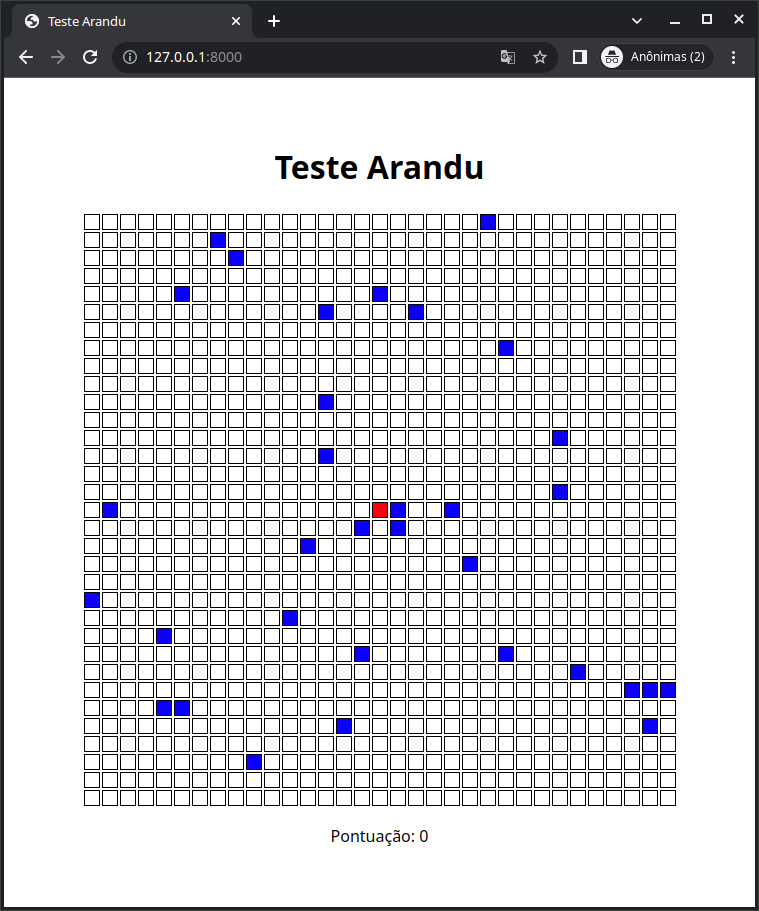

# Teste PHP

Teste de Laravel 8 - Arandu Tech



## Baixando e instalando

 - Pré requisitos: PHP >= 7.3 e extensões exigidas pelo Laravel.
 - Clone o repositório em uma pasta
 - Instale as dependências e compile o JavaScript
```
composer install
npm install
npm run dev
```
 - Configure a chave da aplicação laravel

```
php artisan key:generate
```
## Executando

Utilize o comando `php artisan serve` ou crie um Host Virtual (Xampp, docker...) e acesse a URL da aplicação.

A página da web apresentará um 'tabuleiro', com um quadrado vermelho (jogador) e vários quadrados azuis (inimigos).

Usando as setas do teclado é possível mover o jogador. Sempre que o jogador se move todos os inimigos podem ou não se mover em alguma direação aleatória.

## Arquivos importantes

 - resources/views
    - `game.blade.php` é o arquivo responsável pela visualização do tabuleiro
    - `gameover.blade.php` é uma visualização de tela de fim de jogo

 - app/Models
    - `Player` model que representa o jogador
    - `Enemy` model que representa o inimigo

 - app/Http/Controllers
    - `GameController` controller principal que executa a mecânica do jogo
 - app/Constants
    - `Map` contém definições do tabuleiro do jogo
 - app/Contracts
    - `GameObject` classe base que representa um objeto a ser renderizado no jogo. Os models `Player` e `Enemy` estendem esta classe.

## Desafios

1. O uso de 'números mágicos' no código pode se tornar um grande problema no longo prazo. No projeto, algumas constantes foram criadas para evitar isso, na classe `\App\Constants\Map`. Porém, podemos observar que os identificadores de tecla pressionada ('ArrowUp', 'ArrowDown', 'ArrowLeft' e 'ArrowRight') estão escritos direto no código de execução. Crie um arquivo de constantes `\App\Constants\Movement`, com 4 constantes representando cada direção e referencie essas constantes no código executado onde houver referência a tais valores.

2. Adicione uma regra onde o jogador irá ganhar 10 pontos a cada passo dado.

3. Adicione uma mecânica de jogo que evite que o jogador ou inimgo saiam dos limites do tabuleiro. Escolha entre um dos dois: 'colidir' com as paredes, impedindo o movimento na direção do fim do tabuleiro OU 'teletransporte' para o outro lado da tela (ex: ao sair pela direita, aparece na mesma linha, na casa da esquerda).

4. Adicione a mecânica de 'game-over', que deve ser acionada se, após a movimentação do jogador e dos inmigos, o jogador estiver na mesma casa que um inimigo. Dicas: os models que tem como base o `GameObject` possuem o método `isCollidingWith($object)`, que retorna `true` caso o objeto passado como argumento esteja na mesma casa. Para acionar o game-over, utilizar um `redirect` para a named view `gameover`.

5. **EXTRA** - Crie um novo `GameObject` para representar a moeda. O tabuleiro terá uma moeda por vez, que será colocada em uma posição aleatória. O jogador, ao colidir com a moeda, ganhará 1.000 pontos, e a moeda será colocada em uma outra casa aleatória do tabuleiro.